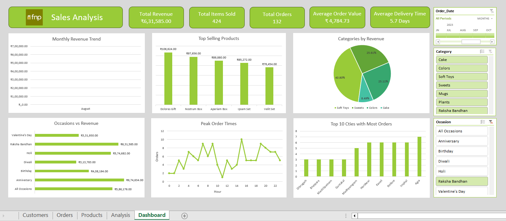

# FnP Sales Analysis Dashboard

## Project Overview

An Excel-based sales analysis project exploring sales performance, customer behaviour, product trends, and order patterns for a gifting business.

**The analysis goes beyond the dashboard.** Alongside building an interactive dashboard, I explored the data further through customer and city-level analysis, delivery time analysis, correlation analysis, and an occasion vs product category heat map to uncover additional patterns and identify potential business opportunities.

## Dashboard Preview

## Tools & Techniques

- **Excel:** PivotTables, PivotCharts, interactive slicers and KPI reporting
- **Power Query:** Data cleaning, transformation and merging tables
- **Data Modelling:** Relationships between tables using key fields
- **Exploratory Analysis:** Customer rankings, geographic analysis, correlation and heat maps

## Key Findings

- February and August were among the strongest months by revenue.
- Anniversary and Raksha Bandhan were leading occasions by revenue.
- Colours was the highest-revenue product category.
- Magnum Set was the top product by revenue.
- Average delivery time varied across occasions.

## Further Analysis

The project also explores repeat purchasing, top customers, city-level revenue, delivery patterns, and product-category performance across gifting occasions.

## Project Files

- [Excel Workbook](dashboard/fnp_sales_analysis.xlsx)
- [Dashboard Analysis Report](reports/fnp_dashboard_analysis.pdf)
- [Further Analysis Report](reports/fnp_further_analysis.pdf)

## Key Takeaway

This project helped me bring together data preparation, analysis, and visualisation while focusing on what the numbers reveal and how those findings can support business decisions.
